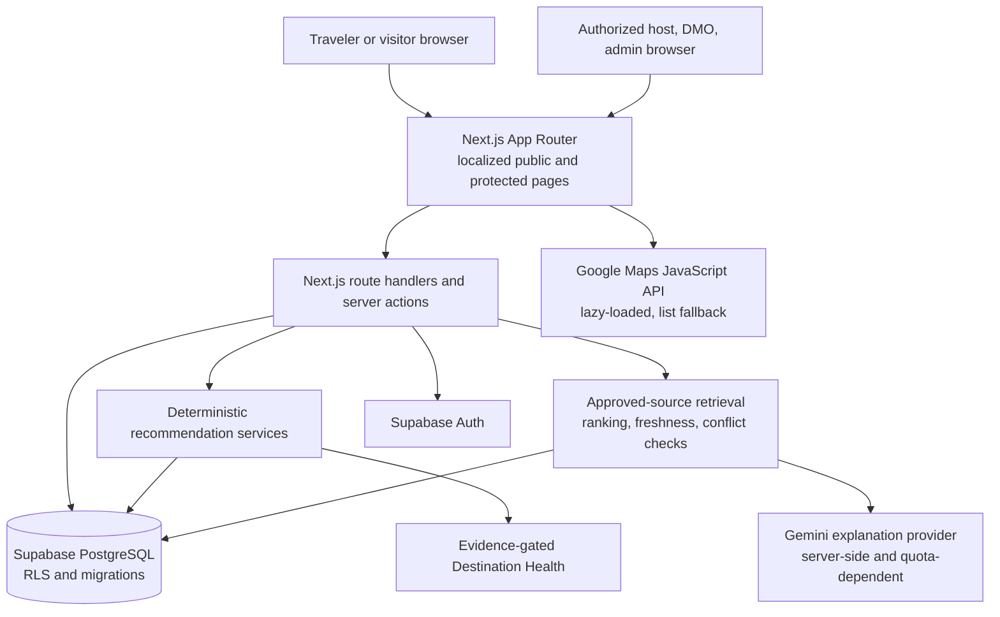

# MICHI Architecture Overview

## Current implementation

## Boundaries

- **Frontend:** Next.js 16 App Router, React 19, strict TypeScript, Tailwind CSS 4, and `next-intl` English/Japanese routing.
- **Server:** route handlers and server actions validate requests and enforce role authorization. Protected routes use the `proxy.ts` session check plus server-side role checks; RLS remains the database boundary.
- **Authentication and storage:** Supabase Auth and PostgreSQL; experience image uploads use Supabase Storage when configured.
- **Recommendation:** deterministic code ranks eligible database candidates; Gemini may only organize supplied itinerary candidates. External verified listings remain separate from MICHI-bookable host inventory.
- **Destination Health:** deterministic formula and status model exist, but score calculation requires complete current evidence. The hosted `destination_health_signals` table is empty, so no current score is available.
- **Cultural knowledge:** source registry and content provide provenance-aware retrieval. Gemini is a server-side explanation provider and may not invent evidence. Last recorded integration report notes live quota exhaustion.
- **Maps:** Google Maps JavaScript API is opt-in; a verified-location list is the fallback. The current catalog lacks verified coordinates, so it does not produce markers.
- **Analytics/DMO:** the database holds pseudonymous product event records and role-restricted aggregate reporting. Current event records are not tourism impact measures.
- **Deployment:** Vercel is the target in project architecture. This audit did not verify a current production deployment or deploy changes.

## Hosted project data boundary

The checked project reference is `sjfcwmaceduwdhpdccyh`. The current catalog has 3 destinations, 15 places, and 3 external listings. It has 0 MICHI experiences, 0 slots, 0 bookings, 0 destination health signals, 0 community-feedback rows, and no role-specific demo accounts. See [DEMO_DATA_POLICY.md](DEMO_DATA_POLICY.md) for the dated counts and interpretation.

## Request paths

1. Public catalog pages read approved public records through the server-side Supabase client and RLS.
2. Guest recommendations submit preference data to the deterministic engine. Authenticated recommendation requests persist account-linked recommendation logs; guest requests use a rate limit. The itinerary UI can emit analytics events. Validate these mutations only on staging.
3. The Cultural Companion retrieves evidence from Supabase, evaluates authority/freshness/conflict, then optionally calls Gemini. Its route records coarse pseudonymous event metadata. Do not live-test questions against production when a no-write audit is required.
4. MICHI booking requires a verified host listing and genuine slot capacity; inventory is currently absent, so the product must not simulate a successful reservation.

See [architecture.md](architecture.md), [DESTINATION_HEALTH.md](DESTINATION_HEALTH.md), [CULTURAL_KNOWLEDGE.md](CULTURAL_KNOWLEDGE.md), and [MAPS_INTEGRATION.md](MAPS_INTEGRATION.md) for implementation detail.
